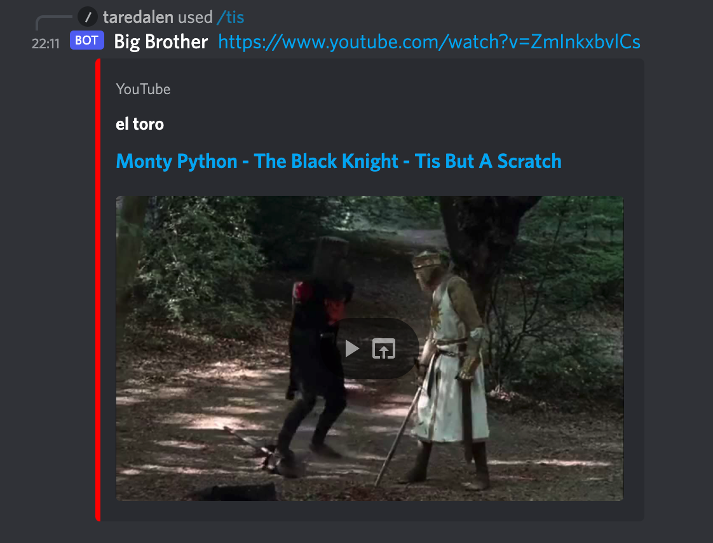

#**BOT JS FOR DISCORD**

---

Le projet consiste à créer un bot sur discord avec lequel on pourra faire plusieurs actions sur le chat d'un serveur.

> #### Renvoyer une vidéo YouTube sur le chat
> - */biggus*  :  
    > renvoie la vidéo YouTube 'Biggus Dickus - Monthy Python, Life of Brian Best Scenes'
> - */sacred* : renvoie la vidéo YouTube 'Every Sperm is Sacred - Monty Python's The Meaning of Life'
> - */tis* : Renvoie la vidéo YouTube 'Monty Python - The Black Knight - Tis But A Scratch'

---

> some */biggus.* text

> ##### Renvoyer une vidéo YouTube sur le chat
> ***/biggus*** Renvoie la vidéo YouTube "Biggus Dickus - Monthy Python, Life of Brian Best Scenes"
> ***/sacred*** Renvoie la vidéo YouTube "Every Sperm is Sacred - Monty Python's The Meaning of Life"
> ***/tis*** Renvoie la vidéo YouTube "Monty Python - The Black Knight - Tis But A Scratch"

> ##### Créer des quizs
> ***/quiz add*** Ajouter des questions à un quiz
> ***/quiz save*** Enregistrer le quiz et lui donner un nom
> ***/quiz help*** Avoir les instrustions pour la création d'un quiz

> ##### Répondre / Lancer des quizs
> ***/start list*** Afficher la liste des quizs disponibles
> ***/start select*** Lancer un quiz par le nom du quiz
> ***/start random*** Lancer un quiz au hasard
>
> Le perdant du quiz parmi les participants se font bannir du serveur.
