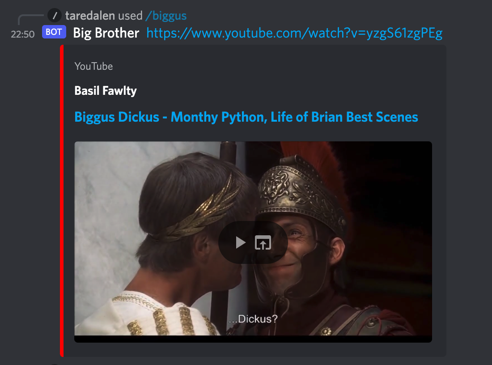
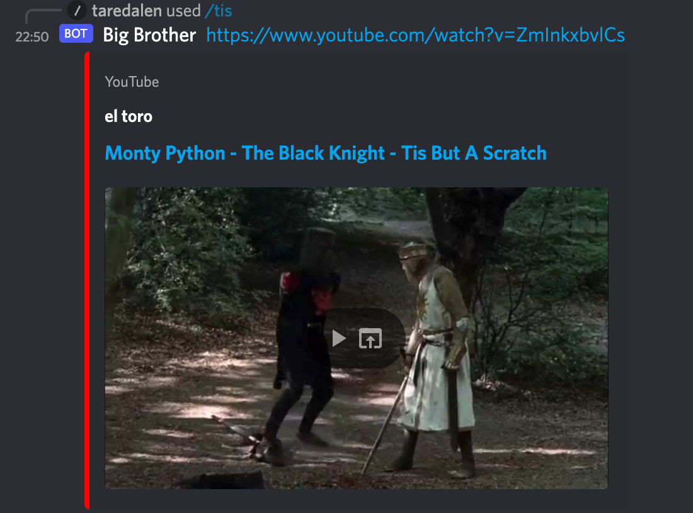
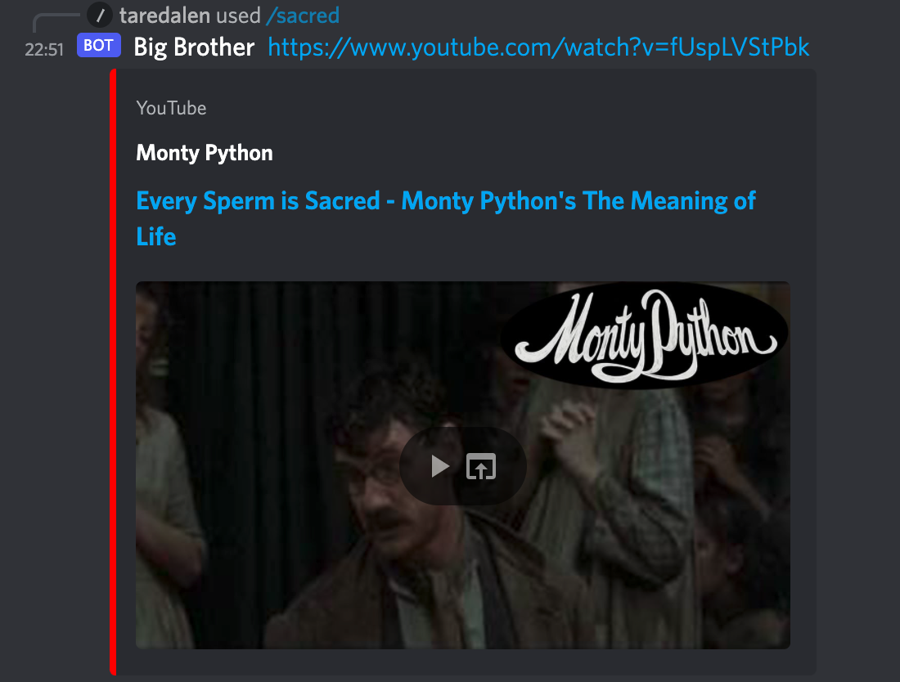
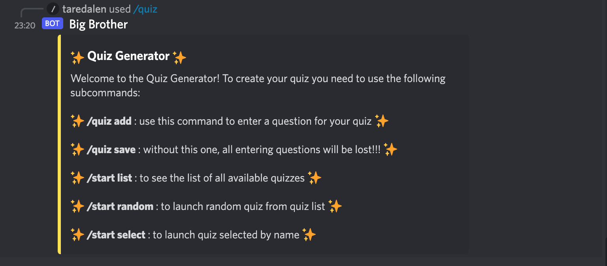
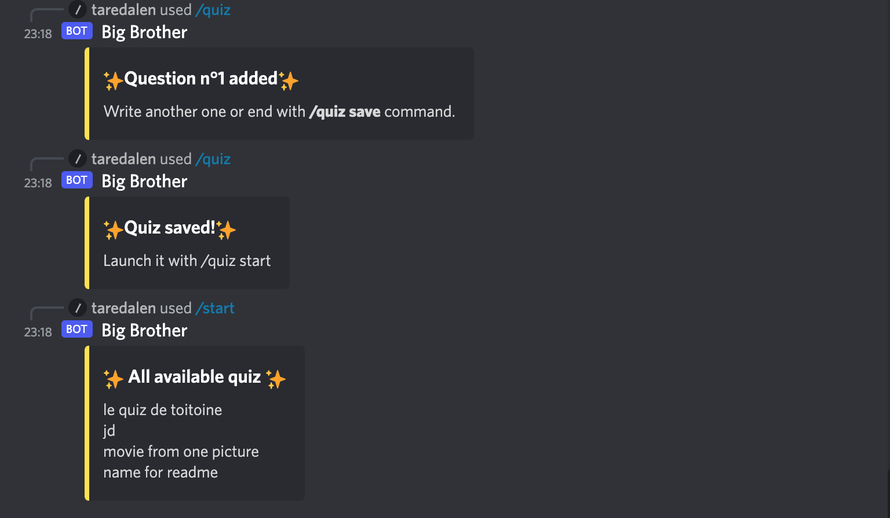
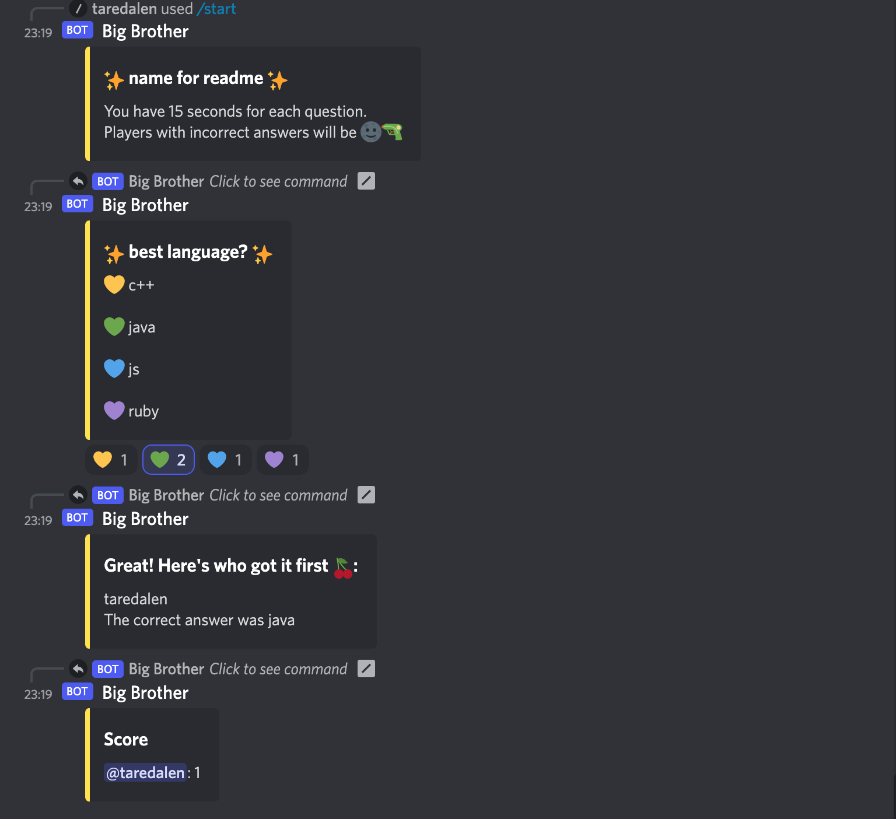
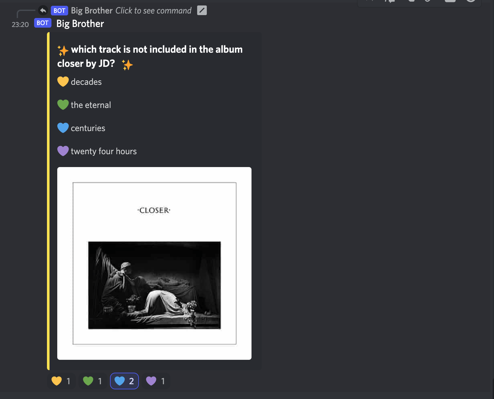

## BOT JS FOR DISCORD


```ruby
Le projet consiste à créer un bot sur discord avec lequel on pourra faire 
plusieurs actions sur le chat d'un serveur.

```
---
```ruby
Pour démarrer le bot il faut un fichier .env avec DISCORD_TOKEN qui correspond au token discord.
Ensuite il suffit d'utiliser la commande: 
```
```
npm run start
```
---

```ruby
Renvoyer une vidéo YouTube sur le chat
```

| Command | Description |
| --- | --- |
| `/biggus` | Renvoie la vidéo depuis YouTube 'Biggus Dickus - Monthy Python, Life of Brian Best Scenes'   |
| `/sacred` | Renvoie la vidéo depuis YouTube 'Every Sperm is Sacred - Monty Python's The Meaning of Life' |
| `/tis`    | Renvoie la vidéo depuis YouTube 'Monty Python - The Black Knight - Tis But A Scratch'    |

<details><summary>Click there to see screens</summary>
<p>

>  

</p>
</details>

---

```ruby
Création et lancement des quiz, le perdant du quiz parmi les participants se font bannir du serveur
```

| Command | Description |
| --- | --- |
| `/quiz add` | Ajouter des questions à un quiz, 3 options pour chacun, la question peut contenir des url images  |
| `/quiz save` | Enregistrer le quiz et lui donner un nom |
| `/quiz help`    |   Avoir les instrustions pour la création d'un quiz, ainsi que les commandes disponibles|
| `/start list` | Afficher la liste des quizs disponibles  |
| `/start select` | Rechercher et lancer un quiz par le nom du quiz |
| `/start random`    | Lancer un quiz au hasard|


<details><summary>Click there to see screens</summary>
<p>

>  

</p>
</details>

```ruby
Pour finir le bot peut bannir des utilisateurs si ils jouent a des jeux faisant partie de la liste de jeux interdis
```
---
```ruby
Created with <з (and pain) by Antoine Ghidini, Laetitia Kamwag & Sebila Doubaeva
```
